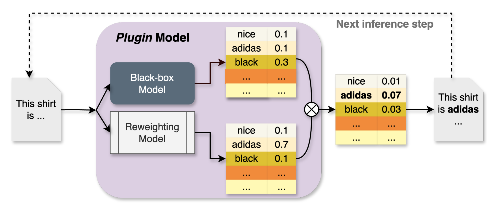
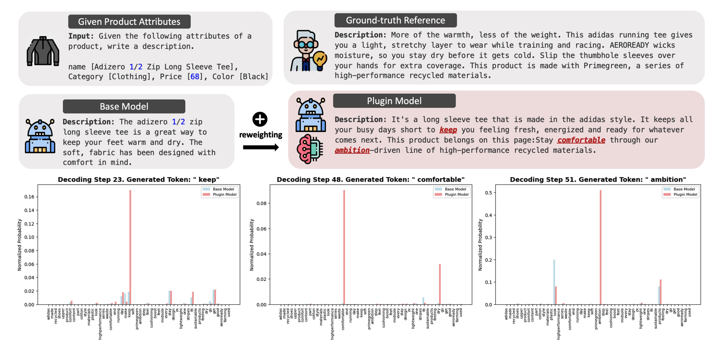

# Code for paper: Logits are All We Need to Adapt Closed Models

This repository contains shell scripts for setting up, training, evaluating, and comparing various models efficiently.

## Abstract

Many commercial Large Language Models (LLMs) are often closed-source, limiting developers to prompt tuning for aligning content generation with specific applications. While these models currently do not provide access to token logits, we argue that if such access were available, it would enable more powerful adaptation techniques beyond prompt engineering. In this paper, we propose a token-level probability reweighting framework that, given access to logits and a small amount of task-specific data, can effectively steer black-box LLMs toward application-specific content generation. Our approach views next-token prediction through the lens of supervised classification. We show that aligning black-box LLMs with task-specific data can be formulated as a label noise correction problem, leading to ***Plugin*** model -- an autoregressive probability reweighting model that operates solely on logits. We provide theoretical justification for why reweighting logits alone is sufficient for task adaptation. Extensive experiments with multiple datasets, LLMs, and reweighting models demonstrate the effectiveness of our method, advocating for broader access to token logits in closed-source models.




## Overview and Usage

### 1. `setup.sh`
This script sets up the necessary environment, installs dependencies, and ensures all required libraries and tools are available before conducting training and evaluation.
```sh
bash setup.sh
```

### 2. `base_model_cross_validation.sh`
Performs cross-validation using the base model. This script is helpful for assessing the performance of the baseline model using standard cross-validation techniques. It will call the [`src/base_model_training.py`](src/base_model_training.py) script to train the model.
```sh
bash base_model_cross_validation.sh
```

### 3. `weighted_model_cross_validation.sh`
Executes cross-validation using a weighted ensemble model. It helps evaluate models that combine multiple sources with different importance weights. It will call the [`src/weighted_decoding.py`](src/weighted_decoding.py) script to train the weighted model.
```sh
bash weighted_model_cross_validation.sh
```

### 4. `plugin_model_cross_validation.sh`
Runs cross-validation for a plugin-based model. This script is useful if additional plugins or extensions are used in the model and need validation. It will call the [`src/plugin_decoding.py`](src/plugin_decoding.py) script to train the plugin model.
```sh
bash plugin_model_cross_validation.sh
```

### 5. `evaluate_models.sh`
Runs model evaluation on pre-trained or newly trained models. This script is useful for testing models on a dataset and generating performance metrics. It will call the [`src/evaluate_models.py`](src/evaluate_models.py) script to evaluate the model.
```sh
bash evaluate_models.sh
```


## Prerequisites
Ensure you have the following dependencies installed:
- Bash (Unix/Linux/macOS)
- Python 3.11 (if models are implemented in Python)
- torch==2.4
- Any additional libraries specified in [`bin/setup.sh`](bin/setup.sh)

## Citation and Contact
If you find this paper useful, please cite our work:
```
@article{hiranandani2025logits,
  title={Logits are All We Need to Adapt Closed Models},
  author={Hiranandani, Gaurush and Wu, Haolun and Mukherjee, Subhojyoti and Koyejo, Sanmi},
  journal={arXiv preprint arXiv:2502.06806},
  year={2025}
}
```

💬 If you have any questions, feel free to contact us through email ([`haolunwu@stanford.edu`](mailto:haolunwu@stanford.edu), [`gaurush@typeface.ai`](mailto:gaurush@typeface.ai)) or Github issues. Enjoy!
